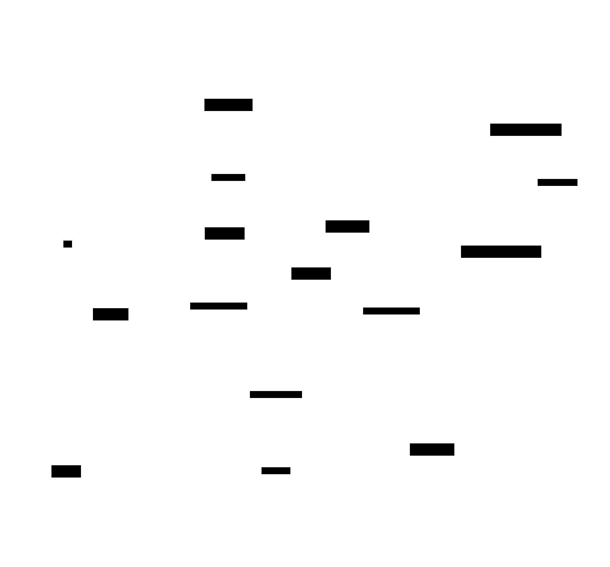
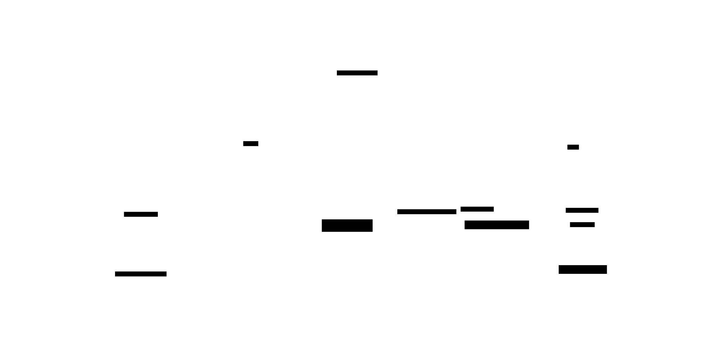
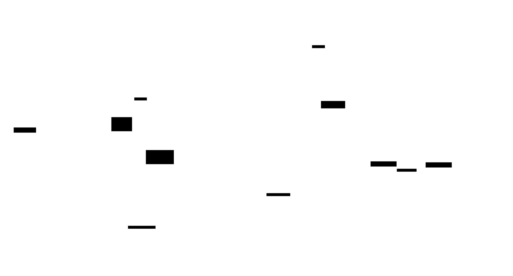

# Sudoku Solver & Game

Outil interactif de résolution de grilles de Sudoku 9x9 en Python. Deux modes : **Jeu** pour s'entraîner, **Solver** pour analyser et comparer 5 algorithmes de résolution.

Projet réalisé dans le cadre de la formation à La Plateforme (Marseille).

## Rôles et Contributeurs

- **Louis** : `script.py` (Parsing des fichiers, génération de puzzles avec garantie d'unicité, validation des coups, cache solutions).
- **Claude** : `solver.py` (Implémentation des 5 algorithmes de résolution, benchmarking SQLite, callbacks d'animation).
- **Manon** : `display.py` (Interface graphique Pygame complète : menus, jeu interactif, solver animé, sauvegarde/reprise, scores, résultats matplotlib).

---

## Installation

1. Assurez-vous d'avoir Python 3.10+ installé.
2. Créez un environnement virtuel :

   ```bash
   python3 -m venv venv
   source venv/bin/activate  # Sur Windows: venv\Scripts\activate
   ```

3. Installez les dépendances :

   ```bash
   pip install -r requirements.txt
   ```

---

## Veille technologique

- **Peter Norvig** - "Solving Every Sudoku Puzzle" (article seminal AC-3+MRV)
- **AC-3 Algorithm** - Constraint propagation standards
- **Benchmarking standards** - Mesure de complexité vs temps réel

## Utilisation

Lancez le programme principal :

```bash
python3 main.py
```

### Mode JEU (Play)



- Cliquez sur **PLAY** et choisissez une difficulté (**EASY**, **NORMAL**, **HARD**).
- **Contrôles clavier** :
  - **Chiffre seul** : Pose une "option" (pencil mark / stash) en gris.
  - **Ctrl + Chiffre** : Valide le chiffre définitivement.
  - **Entrée** : Valide automatiquement si une seule option est présente dans la case.
  - **Flèches** ou **Souris** : Déplacement et sélection.
  - **Échap** : Menu pause (reprendre, sauvegarder et quitter, retour menu principal).
- **Sauvegarde et reprise** : La partie en cours peut être sauvegardée depuis le menu pause. Au retour, le bouton **RESUME GAME** permet de reprendre là où vous en étiez.
- **Mode Hard** : En difficulté HARD, chaque case affiche une couleur vibrante aléatoire et les pencil marks sont désactivés.
- **Scores** : Chaque partie terminée enregistre le temps et la difficulté. Le bouton **SCORES** dans le menu de difficulté affiche l'historique et les statistiques par niveau.

### Mode SOLVER



- Choisissez une grille parmi les fichiers présents dans `grids/`.
- Choisissez l'un des 5 algorithmes :
  1. **Brute Force** : Exploration totale (très lent, timeout 30s).
  2. **Backtracking** : Recherche récursive avec élagage.
  3. **Backtracking MRV** : Backtracking optimisé (choisit la case la plus contrainte).
  4. **Constraint Propagation** : Résolution logique pure (sans recherche).
  5. **Propagation MRV** : Algorithme le plus puissant (Norvig).
- Cliquez sur **SOLVE** pour voir l'algorithme résoudre la grille en temps réel.

---

## Benchmarking

- Chaque résolution enregistre le temps, le nombre d'itérations, le nombre de cases vides et le statut dans `results.db` (base SQLite).
- Tous les runs sont conservés (pas seulement le meilleur temps).
- Le bouton **RESULTS** dans le menu Solver ouvre un écran avec **5 onglets** :
  1. **Time** : barres groupées du temps d'exécution par algorithme et par grille (échelle log).
  2. **Iterations** : barres groupées du nombre d'itérations.
  3. **Difficulty** : courbes du temps en fonction du nombre de cases vides.
  4. **Formulas** : formules de complexité algorithmique en LaTeX.
  5. **Manage** : tableau de tous les résultats avec suppression individuelle (scroll vertical).
- **Toggle par algorithme** : 5 boutons en bas permettent de masquer/afficher chaque algorithme sur les graphiques.
- **Export** : boutons CSV (tous les résultats) et PDF (graphiques).
- **RUN ALL** : lance tous les algorithmes sur toutes les grilles depuis l'interface, avec barre de progression et annulation.
- **RESET** : supprime tous les résultats après confirmation.
- L'outil CLI `regenerate_benchmarks.py` permet de relancer tous les algorithmes sur toutes les grilles :

  ```bash
  python3 regenerate_benchmarks.py              # tous les algorithmes
  python3 regenerate_benchmarks.py --skip-brute  # sans brute force (30s de timeout par grille)
  ```

---

## Architecture Technique



- **`main.py`** : Point d'entrée (lance le menu Pygame).
- **`script.py`** (~440 lignes) : Logique métier -- classe `SudokuGrid`, génération de puzzles avec garantie d'unicité, validation des coups, cache `solutions.json`.
- **`solver.py`** (~885 lignes) : Algorithmes de résolution (5 algorithmes), benchmarking SQLite (`results.db`), CRUD (suppression, mise à jour), `run_all_benchmarks()`.
- **`display.py`** (~2400 lignes) : Interface Pygame complète -- `SceneManager` (transitions), `GameState`, `Button`, sauvegarde/reprise JSON, menus, jeu interactif, solver animé, graphiques matplotlib (5 onglets), système audio (6 SFX + 2 musiques).
- **`regenerate_benchmarks.py`** : Outil CLI pour relancer les benchmarks sur toutes les grilles.
- **`grids/`** : Fichiers de grilles au format texte (`_` pour vide).
- **`sounds/`** : 6 effets sonores (`click`, `select`, `place`, `error`, `victory`, `ding`) et 2 musiques de fond (`ambient_calm.ogg`, `mondotek_alive.ogg`).
- **`saves/`** : Sauvegardes JSON des parties (`scores.json`, `current_game.json`).
- **`solutions.json`** : Cache puzzle vers solution (évite de résoudre deux fois la même grille).
- **`results.db`** : Base SQLite des benchmarks (exclue du Git).

---

## Audio

L'application inclut un système audio complet avec mute/volume :

- **Effets sonores** : `click` (bouton), `select` (case), `place` (chiffre correct), `error` (mauvaise réponse), `victory` (puzzle terminé), `ding` (fin solver).
- **Musiques de fond** : `ambient_calm.ogg` (mode jeu, 30% volume), `mondotek_alive.ogg` (écran résultats).
- **Contrôles** : bouton mute (M/S) + slider de volume, affichés en bas à droite de chaque écran.

Les fichiers audio sont dans `sounds/`. L'application fonctionne sans problème si le dossier est absent (fallback silencieux).

---

## Analyse des algorithmes

### Le Sudoku comme problème informatique

Le Sudoku est un problème de satisfaction de contraintes (CSP). Chaque case vide est une variable, son domaine est {1..9}, et les contraintes imposent que chaque chiffre n'apparaisse qu'une fois par ligne, colonne et bloc 3x3. Chaque case est donc liée à 20 autres cases (ses *peers*) : 8 dans sa ligne, 8 dans sa colonne, et 4 supplémentaires dans son bloc.

Les différences entre nos algorithmes tiennent à l'exploitation de ces contraintes : plus un algorithme les exploite tôt, moins il explore de possibilités inutiles.

### 1. Force brute

**Principe** : Remplir toutes les cases vides avec des chiffres de 1 à 9, puis vérifier si la grille complète est valide.

**Fonctionnement** : L'algorithme collecte les cases vides, les remplit une par une de manière récursive, et ne valide la grille qu'une fois toutes les cases remplies. Si la grille est invalide, il remonte d'un cran et essaie le chiffre suivant.

**Le problème** : Aucune vérification n'est faite pendant le remplissage. Si la première case reçoit un chiffre incompatible, l'algorithme remplit quand même les 40 ou 50 cases restantes avant de constater l'échec. L'espace de recherche théorique est de 9^m combinaisons (m étant le nombre de cases vides). Sur une grille difficile (50+ cases vides), cela dépasse les capacités de calcul raisonnables. Un timeout de 30 secondes est nécessaire pour éviter un blocage.

**Ce qu'on en retient** : Vérifier la validité *après coup* est un gaspillage. Il faut couper les branches mortes le plus tôt possible.

### 2. Backtracking

**Principe** : Même approche récursive, mais on vérifie la validité *avant* de placer chaque chiffre.

**Fonctionnement** : Pour chaque case vide (parcourue de gauche à droite, de haut en bas), l'algorithme teste les chiffres de 1 à 9. Avant de placer un chiffre, il vérifie qu'il n'entre en conflit avec aucun de ses 20 peers. Si aucun chiffre ne convient, il revient en arrière (*backtrack*) et modifie la case précédente.

**Le gain** : En vérifiant la validité immédiatement, chaque branche invalide est coupée dès le premier conflit au lieu d'être explorée jusqu'au bout. En pratique, le nombre de combinaisons explorées chute de plusieurs ordres de grandeur par rapport à la force brute.

**La limite** : L'algorithme traite les cases dans un ordre fixe (haut-gauche vers bas-droite). Il peut passer du temps sur une case qui a 8 candidats possibles alors qu'une autre case n'en a qu'un seul. L'ordre d'exploration n'est pas optimal.

### 3. Backtracking avec heuristique MRV

**Principe** : Au lieu de traiter les cases dans l'ordre de lecture, on traite en priorité la case qui a le moins de candidats valides (*Minimum Remaining Values*).

**Fonctionnement** : L'algorithme calcule d'abord les candidats possibles pour chaque case vide. À chaque étape, il sélectionne la case avec le moins de candidats. Lorsqu'un chiffre est placé, les candidats de ses peers sont mis à jour en temps réel. Si un peer se retrouve avec zéro candidat, une contradiction est détectée immédiatement et l'algorithme revient en arrière.

**Le gain** : L'heuristique MRV fait qu'on traite d'abord les décisions les plus contraintes, celles où il y a le moins de choix possibles. Cela réduit l'arbre de recherche : au lieu de brancher sur 9 possibilités, on branche souvent sur 2 ou 3. La mise à jour des candidats en temps réel permet aussi de détecter les impasses sans descendre plus profondément dans la récursion.

**La limite** : La mise à jour des candidats reste locale. Quand on place un chiffre, on retire ce chiffre des peers directs, mais on ne propage pas les conséquences en chaîne. Si le placement d'un 7 réduit un peer à un seul candidat, ce candidat n'est pas automatiquement placé.

### 4. Propagation de contraintes (AC-3)

**Principe** : Résoudre par déduction logique pure, sans essai-erreur. Appliquer des règles de raisonnement en cascade jusqu'à ce que plus aucune déduction ne soit possible.

**Fonctionnement** : Deux règles sont appliquées en boucle :

- **Naked Single** : Si une case n'a qu'un seul candidat, ce chiffre est placé. On le retire alors des candidats de ses 20 peers, ce qui peut créer d'autres naked singles en chaîne.

- **Hidden Single** : Pour chaque unité (ligne, colonne ou bloc), si un chiffre ne peut aller que dans une seule case, il y est placé. Ce chiffre est ensuite retiré des peers de cette case.

La boucle continue tant que l'une de ces règles produit un progrès. Chaque placement peut déclencher une cascade de déductions.

**Le gain** : L'algorithme reproduit le raisonnement d'un joueur humain. Les grilles faciles et moyennes sont résolues instantanément, sans aucune exploration.

**La limite** : Certaines grilles (typiquement les grilles difficiles) présentent des situations où aucune case n'a un seul candidat et aucun chiffre n'est forcé dans une unité. L'algorithme se bloque : il ne sait pas faire de choix hypothétique. Il ne résout donc pas toutes les grilles.

### 5. AC-3 + Backtracking MRV (approche Norvig)

**Principe** : D'abord déduire tout ce qui peut l'être par propagation, puis lorsque la déduction seule ne suffit plus, faire un choix sur la case la plus contrainte et relancer la propagation.

**Fonctionnement** en deux phases :

1. **Propagation** : Application des règles naked single et hidden single jusqu'à stabilisation.
2. **Recherche** : S'il reste des cases non résolues, sélection de la case MRV et essai de chaque candidat. Après chaque essai, l'état complet (grille + candidats) est sauvegardé, et la propagation est relancée. Si une contradiction apparaît, l'état est restauré et le candidat suivant est essayé.

**Le gain** : La propagation entre chaque essai élimine des branches entières de l'arbre de recherche. Là où le backtracking MRV seul doit explorer plusieurs niveaux de récursion, un seul essai suivi d'une propagation peut résoudre des dizaines de cases d'un coup. En pratique, cet algorithme résout n'importe quelle grille valide en moins d'une milliseconde.

**Inspiré de** : L'article de Peter Norvig *"Solving Every Sudoku Puzzle"*, qui démontre que cette combinaison propagation + recherche est suffisante pour résoudre tous les Sudoku connus.

### Génération des puzzles

La génération d'un puzzle suit trois étapes :

1. **Grille complète aléatoire** : Le backtracking génère une grille valide complète en mélangeant aléatoirement l'ordre des chiffres testés à chaque case. Cela produit une grille différente à chaque appel.

2. **Retrait de cases** : Les cases sont retirées une par une, dans un ordre aléatoire. Le nombre de cases retirées dépend du niveau de difficulté (easy : 31-45 cases retirées, normal : 46-54, hard : 55-64).

3. **Garantie d'unicité** : Après chaque retrait, un backtracking rapide compte le nombre de solutions de la grille partielle. Si le retrait crée une seconde solution, la case est remise en place et on passe à la suivante. Ce test s'arrête dès que 2 solutions sont trouvées pour rester efficace.

Ce mécanisme garantit que chaque puzzle généré a exactement une solution, condition nécessaire pour un Sudoku valide.

### Tableau comparatif

| Algorithme | Stratégie | Complexité pire cas | Résout toute grille | Vitesse pratique |
| --- | --- | --- | --- | --- |
| Force brute | Essai complet, validation finale | O(9^m) | Oui (si pas de timeout) | Très lent |
| Backtracking | Essai + validation immédiate | O(9^m) | Oui | Moyen |
| Backtracking MRV | Essai + case la plus contrainte | O(9^m) | Oui | Rapide |
| AC-3 | Déduction logique pure | O(d x n) | Non | Très rapide (si suffisant) |
| AC-3 + MRV | Déduction + recherche ciblée | O(d x n) + résiduel | Oui | < 1 ms |

m = nombre de cases vides, d = taille du domaine (9), n = nombre de cases (81)
